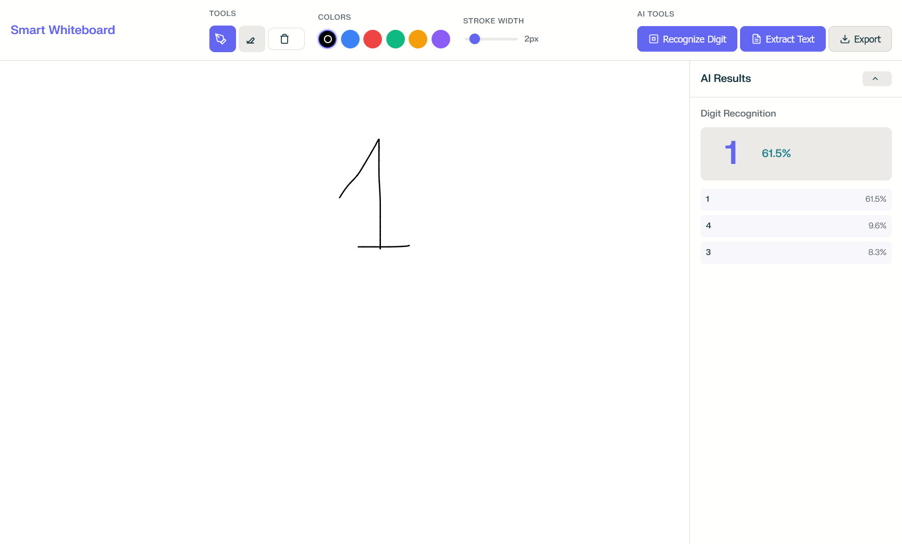
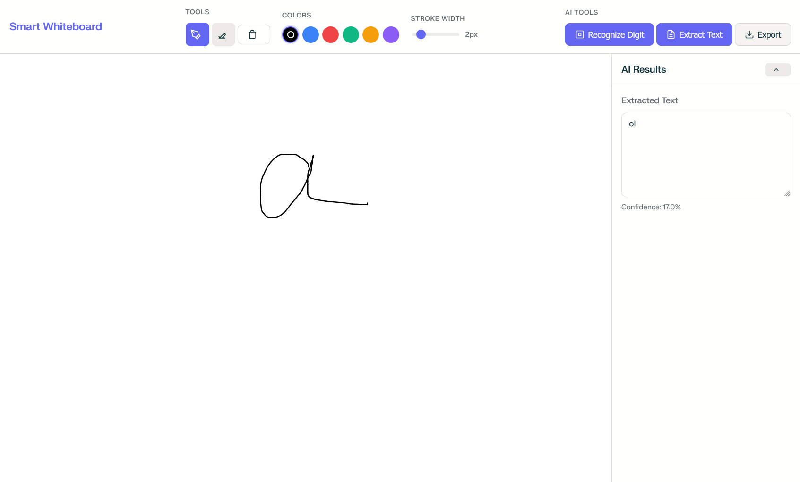
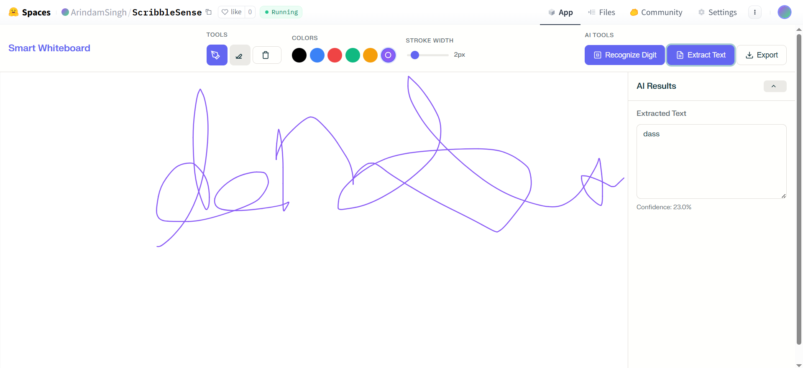

<!-- ---
title: ScribbleSense
emoji: 🔥
colorFrom: yellow
colorTo: gray
sdk: docker
pinned: false
license: apache-2.0
short_description: An open-source AI whiteboard - Draw, Recognise digit.
--- -->

# ScribbleSense [[Live](https://singharindam.github.io/ScribbleSense/frontend/index.html) | [GitHub](https://github.com/SinghArindam/ScribbleSense)]

An open-source **AI whiteboard** that lets you draw freely, then:

* 🔢 recognise a hand-written **digit** in one click  
* 📝 run lightweight **hand-written OCR** on any selection

All inference happens locally (CPU-only by default) and return.
  
---

### Digit Recognize


### OCR Text







---

## 1. Journey

1. **Ideation**  
   I wanted an Excalidraw-smooth canvas attached to tiny, fast ML models that run **on low end devices**.

2. **Prototype (v0.0.1)**  
   * Static HTML + CDN UMD bundles for React / Excalidraw.  
   * FastAPI backend exposing `/digit` (MNIST CNN in ONNX) and `/ocr` (EasyOCR).  
   * Canvas selection exported as PNG → sent via `multipart/form-data`.

3. **Refinement (v0.1.0, current)**  
   * Mounted `StaticFiles` at `/`, so the backend serves `index.html` directly.  
   * Added CORS, automatic model download, checksum verification.  
   * Benchmarked: digit ≈ 10 ms, OCR 50-80 ms on Intel i5-8265U.

4. **Next stops (see Road-map)**  
   * GPU toggle (CUDA-enabled image).  
   * Front-end rewrite in TypeScript + Vite for power users.
   * Shape recognition, formula OCR, and real-time collaboration.

---

## 2. Tech Stack

| Layer        | Choice                              | Rationale                          |
|--------------|-------------------------------------|------------------------------------|
| Canvas       | **Excalidraw** (UMD)                | Hand-drawn aesthetics, huge OSS community |
| Web Runtime  | React 18 (UMD)                      | Minimal setup; no bundler needed   |
| API server   | **FastAPI** + Uvicorn               | Async, auto-docs, Starlette static |
| ML runtime   | **ONNX Runtime** (CPU)              | 40 kB MNIST CNN ⇒ 99 % accuracy, sub-10 ms |
| OCR          | **EasyOCR** (Light English model)   | ~44 MB download, plain CPU, easy install |
| Image utils  | OpenCV-Python (headless)            | Reliable resize / threshold        |
| Packaging    | Docker Compose (single service)     | One-liner spin up                  |

---

## 3. Quick Start

```
git clone https://github.com//scribblesense.git
cd scribblesense           # repo root
docker compose up --build  # pulls python:3.11-slim & sets everything up
```

Open `http://localhost:8000`  
Draw → select → click **🔢** or **📝**.

---

## 4. Directory Structure

```
scribblesense/
├─ docker-compose.yml
└─ ml-service/
   ├─ Dockerfile
   ├─ requirements.txt
   ├─ download_models.py      # grabs digit_cnn.onnx (~40 kB)
   ├─ main.py                 # FastAPI app + ML pipelines
   └─ static/
       └─ index.html          # standalone front-end
```

---

## 5. API Reference

| Route   | Method | Payload                        | Returns        |
|---------|--------|--------------------------------|----------------|
| `/digit`| POST   | `multipart/form-data`, key `file` = PNG selection | `{"pred": 7}` |
| `/ocr`  | POST   | same                           | `{"pred": "hello world"}` |

Swagger/OpenAPI docs auto-generated at **`/docs`**.

---

## 6. Models

### 6.1 Digit CNN (`digit_cnn.onnx`)
* Architecture: 2 × Conv (3×3) → 2 × MaxPool → 2 × FC  
* Params: 12 895 (≈ 40 kB)  
* Accuracy: 99.02 % on MNIST test set  
* Source: Hugging Face repo [`terfm/mini-mnist-onnx`] (MIT) — auto-downloaded on first run, verified via SHA-256.

### 6.2 EasyOCR (English)
* CRNN backbone + CTC decode.  
* Model downloaded automatically (`~/.EasyOCR/`).  
* GPU optional (`reader = easyocr.Reader([...], gpu=True)`).

---

## 7. Performance Benchmarks (v0.1.0)

| Machine                 | Digit (ms) | OCR (ms) |
|-------------------------|-----------:|---------:|
| Intel i5-8265U @1.6 GHz | **9.4**    | 53-78    |
| Apple M1 Air (Rosetta)  | **5.1**    | 42-60    |

Numbers are median of 100 runs, selection size ≤ 200 × 200 px.

---

## 8. Development Workflow

```
# run backend with auto-reload (outside Docker)
python -m venv .venv && source .venv/bin/activate
pip install -r ml-service/requirements.txt
cd ml-service
python download_models.py
uvicorn main:app --reload
```

Then open `static/index.html` directly in your browser **OR** run a tiny HTTP server:

```
python -m http.server 8000 -d ml-service/static
```

---

## 9. Road-map

- [ ] GPU build (CUDA 12 base image).  
- [ ] **TypeScript + Vite** front-end rewrite with state persistence.[1]  
- [ ] Free-hand shape → neat SVG auto-polish.  
- [ ] Latex formula OCR + MathJax render.  
- [ ] Multi-user live board (WebRTC / Yjs).  
- [ ] PWA packaging & offline install banner.  

Contributions welcome — open an issue or PR!

---

## 10. Versioning

| Version | Date (YYYY-MM-DD) | Highlights |
|---------|------------------|------------|
| 0.1.0   | 2024-06-xx        | One-container release; static site served at `/`; CORS; model auto-download |
| 0.0.1   | 2024-06-xx        | Prototype with separate front-end folder |

Semantic Versioning (MAJOR.MINOR.PATCH) is followed; **API will remain stable within the same MAJOR series**.

---

## 11. Changelog

See [`CHANGELOG.md`](CHANGELOG.md) for exhaustive commit-level notes.

---

## 12. License

`Apache License` — see [`LICENSE`](LICENSE).

---

## 13. Acknowledgements

* **Excalidraw** for the web-canvas magic.  
* **Hugging Face** community for the mini MNIST model.  
* **Jaided AI** for EasyOCR.  
* FastAPI & Starlette for making back-end life … fast.  
* Docker for container sanity.

Enjoy ScribbleSense! If you build something fun (or break it gloriously) let us know. 🚀

